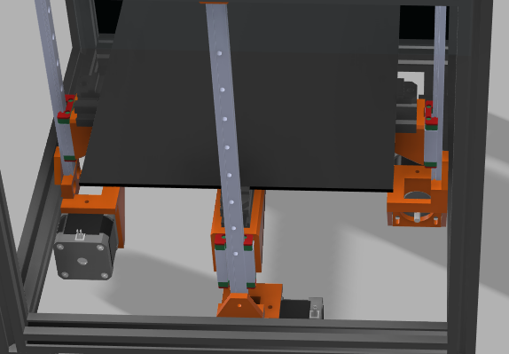
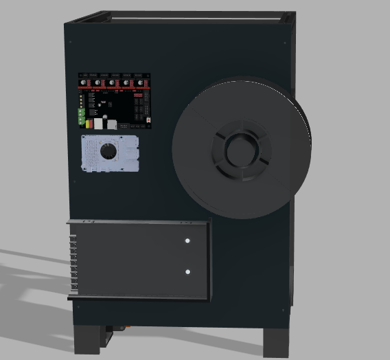

# CoreXY DIY Printer Build Log

**Total Time Spent So Far:** ~37 hours

---

## Day 1 – Research (June 14th)

After evaluating various printer designs, I decided to build a **CoreXY printer** because of its **high speed, accuracy, and reliability** compared to traditional bedslinger designs.  
An enclosed build was important to me as I want to print higher-temperature filaments like PETG, ABS, or Nylon with consistent results.

Key design considerations:

- Considering a **rail-driven system** instead of fully belt-driven for added rigidity (still undecided).
- Budget allocation for a **BLTouch** auto-bed-leveling sensor.
- Proper **printer enclosure** for material versatility and print quality.

**Time Spent:** 3h

---

## Day 2 – Frame Assembly (June 30th)

Started building the **frame using 2020 aluminum extrusion**, with a total cage size of **470 by 300 mm**. This forms the main structural base for the printer.
I also looked at some options for an enclosure so that I may be able to print in other filaments that do require an enclosure but I think thats just out of scope for now 

**Time Spent:** 3h

---

## Day 3 – Gantry Build (June 5th)

Returned to the project after a short break and made major progress:

- Added **corner brackets** to strengthen the frame.
- Increased printer height by **30 mm** for more build volume.
- Completed most of the **gantry assembly**, using **NEMA 17 motors**, **MGN12 linear rails**, and a **belt-driven motion system** for now.

**Time Spent:** 10h

---

## Day 4 – Z-Axis Assembly (June 10th)

Focused on the **Z-axis assembly** today and added some **quality-of-life improvements** like adjustable printer feet.

- Used **two stepper motors** for Z-axis movement.
- Planned to use a **220x220 mm heated bed** ([link](https://novo3d.in/3d-printer-heatbed-220x220mm/)).
- Built on **mgn-12 and mgn9linear rails with timing belt-driven carriages** for smooth and stable vertical motion.

  

**Time Spent:** 12h

---

## Day 5 – Hotend & Extruder Setup (July 25th)

Worked on the **EVA 2.4-based hotend** assembly:
The EVA is a modular toolhead assembly, with an entire ecosystem of community made parts for all sorts of extruders and hotends and probes and fans.
I would like to disclose that YES, I am using their base 3D model for my toolhead but i'm swapping out the components that i'm using for the default stuff and thus am changing some of the core parts to fit it 

- Planning to use a **Bambu X1** hotend for easy availibility in india and cheap cost.
- Extruder will be an **LDO Orbiter** for high precision and lightweight direct drive.

**Time Spent:** 7h

---

## Day 6 and 7 - Requested fixes and updates to readme(Aug 6-7)

Changed the Z axis to have 3 steppers as per feedback(same assembly) 

Additionally, added some brackets that were missing 
Added the back electronics stuff(PSU, raspi, BTT mobo) 
Changed some suppliers around in the BOM and changed out the mobo and added some stuff I forgot(also removed the BLtouch, will get later)

And worked on updating the README and Journal!! 
**Time Spent:** 3h
