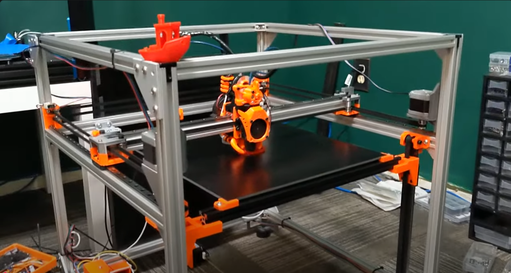
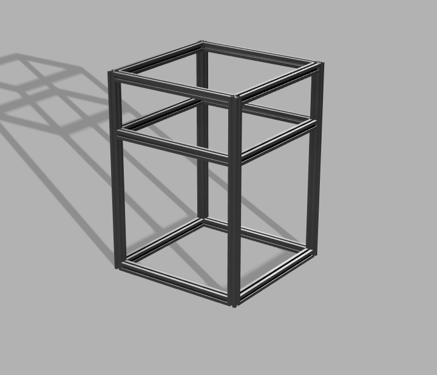
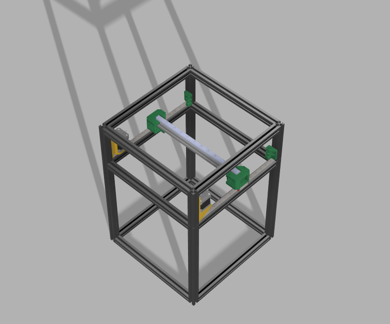
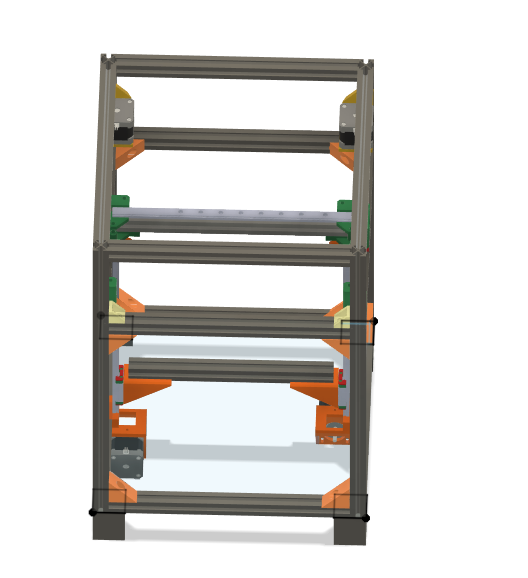
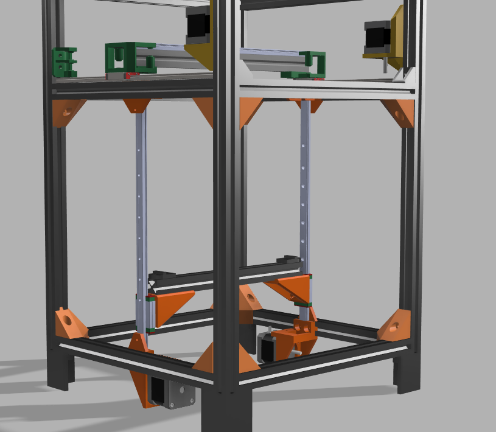

# Day 1 - Research(June 14th)

I decided on making a CoreXY printer, as it is much faster and I believe its the best choice for speed and precision. I want this printer to be enclosed, so that I can print filaments other than PLA. 

I looked at a couple DIY corexys for inspiration, like this excellent low cost one 
 
by [Rolohaun](https://www.youtube.com/watch?v=HWfT2JbMOvM) 

Some important things I wanted to keep in mind though: 
I want to _try_ and use a rail driven system, as its more rigid than a belt driven system - however, the jury is still out on this one 
I defo want to leave budget for a BLTouch and a good quality printer enclosure 

**Time Spent - 1h30**

# Day 2 - Lock in(probably) June 30th

I hope i can finish this printer within the next few days - so without further ado, we shall begin 
PT1(around 6 PM): Built the frame with 2020 aluminium extrusion for a total cage size of 410x260mm 
 

# Day 3 - Did not lock in lmao(June 5th)

Today, I remembered this project and started working on it again 
Added the corner brackets to the big boi and also increased its height by 30mm 
Most importantly, I pretty much finished my gantry 
Nema 17, belt driven goodness on mgn12 linear rails, with some other cool stuff 
However, I stole the toolhead from SimpleCore as a temporary placeholder kinda thing, I dont think I have the parts to build something like that and I dont think I can find those parts 

**Time Spent: 6hr**

# Day 4 - Z assembly (June 10th)

Today, I worked on the Z assembly plus some other QOL stuff(feet) 
I used two steppers for this, and I intend to use a [220mm bed](https://novo3d.in/3d-printer-heatbed-220x220mm/)  
Again, this is similar to the gantry as it uses those linear rails with carriages and belts. I was thinking of using three steppers for this, but keeping in mind the size of this medium boi, dont think thats the greatest idea
 

**Time Spent: 85hr**
