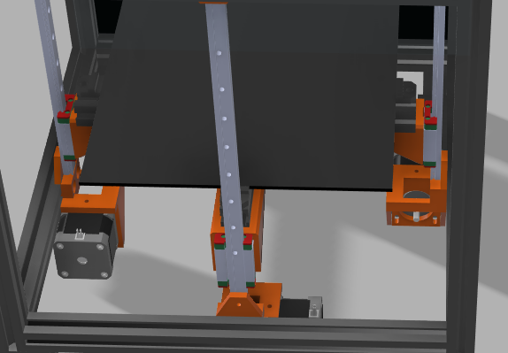

# CoreXY DIY 3D Printer

an epik corexy 3d printer!! super big and awesome

---

## Goals

- **Speed & Precision:** CoreXY kinematics allow fast movement without sacrificing accuracy.
- **Material Versatility:** Enclosed chamber enables printing of PETG, ABS, Nylon, and other temperature-sensitive materials.
- **Rigid Mechanical Base:** Linear rails and aluminum extrusion reduce flex and vibration.
- **Upgradeable Design:** Modular toolhead and electronics for future expansions.

---

## Features

- **CoreXY Motion System:** Faster and lighter X/Y movement compared to Cartesian bedslingers.
- **Fully Enclosed Build Chamber:** Maintains thermal stability for high-temp materials.
- **Linear Rail Motion:** MGN-series rails for minimal play and smooth travel.
- **Direct Drive Extruder:** LDO Orbiter for lightweight, high-precision filament feeding.
- **BLTouch Auto-Bed-Leveling:** Consistent first layers with minimal manual adjustment.
- **Compact Medium Build Volume:** 220 × 220 mm bed with an optimized footprint.

---

## Stuff in the printer

### Eva 2.4 Toolhead

Standardized toolhead, easy to get new stuff for if I replace a component and the ecosystem of parks is awesome 
Also, just looks really cool 

### Toolhead and extruder

Did not want to use bowden extruder, so I went with the best and cheapest DD extruder I could find - the LDO orbiter 
For the hotend, the bambu hotend was just really cheap and high quality(had bad experiences with the next cheapest option, an E3D toolhead(firefighters called)) 

### Frame

Aluminium profiles were honestly a no brainer, and the size was to fit my linear rail sizes

###

---

## Images

### Frame Assembly

### Gantry Assembly

### Z-Axis Assembly

### Hotend and Extruder

### Full assembly

---

## BOM

| [S.NO](http://s.no/) | ITEM                           | QTY | SOURCE                                                                                                                                                                                                                                                                                                                                                                                                                                                                                                                                                                                                                                                                                                                                                                                                                                                                                                                                                                                                                                                                                                                                                                                                                   | UNIT PRICE | TOTAL PRICE |
| -------------------- | ------------------------------ | --- | ------------------------------------------------------------------------------------------------------------------------------------------------------------------------------------------------------------------------------------------------------------------------------------------------------------------------------------------------------------------------------------------------------------------------------------------------------------------------------------------------------------------------------------------------------------------------------------------------------------------------------------------------------------------------------------------------------------------------------------------------------------------------------------------------------------------------------------------------------------------------------------------------------------------------------------------------------------------------------------------------------------------------------------------------------------------------------------------------------------------------------------------------------------------------------------------------------------------------ | ---------- | ----------- |
| 1                    | 300mm 2020 Aluminium Extrusion | 12  | [https://novo3d.in/aluminium-profiles-2020/](https://novo3d.in/aluminium-profiles-2020/)                                                                                                                                                                                                                                                                                                                                                                                                                                                                                                                                                                                                                                                                                                                                                                                                                                                                                                                                                                                                                                                                                                                                 | 1.36       | 16.32       |
| 2                    | 470mm 2020 Aluminium Extrusion | 4   | [https://novo3d.in/aluminium-profiles-2020/](https://novo3d.in/aluminium-profiles-2020/)                                                                                                                                                                                                                                                                                                                                                                                                                                                                                                                                                                                                                                                                                                                                                                                                                                                                                                                                                                                                                                                                                                                                 | 2.15       | 8.6         |
| 3                    | LDO Orbiter                    | 1   | [https://dc3d.in/shop/voron-v2-4-parts/ldo-orbiter-extruder-v2-0/?srsltid=AfmBOoqgHSWJ0ldcA_kW3xPiR3idW2MW9TanWrP5BYfCecyTQs3Tvrpf](https://dc3d.in/shop/voron-v2-4-parts/ldo-orbiter-extruder-v2-0/?srsltid=AfmBOoqgHSWJ0ldcA_kW3xPiR3idW2MW9TanWrP5BYfCecyTQs3Tvrpf)                                                                                                                                                                                                                                                                                                                                                                                                                                                                                                                                                                                                                                                                                                                                                                                                                                                                                                                                                   | 63.06      | 63.06       |
| 4                    | Bambu Hotend                   | 1   | [https://robu.in/product/bambu-lab-hotend-for-x1-p1-series/?gad_source=4&gad_campaignid=17427803012&gclid=CjwKCAjw7rbEBhB5EiwA1V49nUTjMHmR5EJ1DAisiljdCTS3_tIAi6PPP6ofAS36TDMhnQQ1ii95YBoCdywQAvD_BwE](https://robu.in/product/bambu-lab-hotend-for-x1-p1-series/?gad_source=4&gad_campaignid=17427803012&gclid=CjwKCAjw7rbEBhB5EiwA1V49nUTjMHmR5EJ1DAisiljdCTS3_tIAi6PPP6ofAS36TDMhnQQ1ii95YBoCdywQAvD_BwE)                                                                                                                                                                                                                                                                                                                                                                                                                                                                                                                                                                                                                                                                                                                                                                                                             | 14.9       | 14.9        |
| 5                    | MGN12H 30CM(for X and Z        | 2   | [https://novo3d.in/mgn12h-linear-rail/](https://novo3d.in/mgn12h-linear-rail/)                                                                                                                                                                                                                                                                                                                                                                                                                                                                                                                                                                                                                                                                                                                                                                                                                                                                                                                                                                                                                                                                                                                                           | 16.04      | 32.08       |
| 6                    | MGN9H 30CM(Y)                  | 1   | [https://novo3d.in/mgn9h-linear-rail/](https://novo3d.in/mgn9h-linear-rail/)                                                                                                                                                                                                                                                                                                                                                                                                                                                                                                                                                                                                                                                                                                                                                                                                                                                                                                                                                                                                                                                                                                                                             | 16.04      | 16.04       |
| 7                    | M3, M4, M5 Assortment          | 1   | [https://www.amazon.in/Epi-Torque-Stainless-Internal-Assortment-Matching/dp/B08MYB643Z/ref=sr_1_4?crid=28KY8MSBRSGN3&dib=eyJ2IjoiMSJ9.-6yRlZ-AbrmwqY7QViRq-gvquyKS3HNeZavoVZU7wctPFWlM3fnq_OmJOSkywvYyBuRhcKxumowbnTslP2cPyku_b1P6HWrdaTabr0JIsXm6NalIjma5ayyUJ2W9-HTbtiXbHqEZtDmFqmhMoQM84brreHoQ2UTcNKI78R7Kd9p8axRtOcz30OgBwtt1XEVUZ_lcgcryg8ZLH5-IUt9lzrIq0Tl1VJQuMJPqHNYZp1-xp7lbfzxhHIlU94qrwAZ3oHk8Xqwt4KL5TLkpQx6u_w_P8gs8yHc_SrJ3NfMRSek.OF8WF4u_fmlcvlr4NW7RW1KGzlGpqLDEIg20VCRtQO8&dib_tag=se&keywords=M3+assortment&qid=1754058784&s=industrial&sprefix=m3+assortmen,industrial,212&sr=1-4&th=1](https://www.amazon.in/Epi-Torque-Stainless-Internal-Assortment-Matching/dp/B08MYB643Z/ref=sr_1_4?crid=28KY8MSBRSGN3&dib=eyJ2IjoiMSJ9.-6yRlZ-AbrmwqY7QViRq-gvquyKS3HNeZavoVZU7wctPFWlM3fnq_OmJOSkywvYyBuRhcKxumowbnTslP2cPyku_b1P6HWrdaTabr0JIsXm6NalIjma5ayyUJ2W9-HTbtiXbHqEZtDmFqmhMoQM84brreHoQ2UTcNKI78R7Kd9p8axRtOcz30OgBwtt1XEVUZ_lcgcryg8ZLH5-IUt9lzrIq0Tl1VJQuMJPqHNYZp1-xp7lbfzxhHIlU94qrwAZ3oHk8Xqwt4KL5TLkpQx6u_w_P8gs8yHc_SrJ3NfMRSek.OF8WF4u_fmlcvlr4NW7RW1KGzlGpqLDEIg20VCRtQO8&dib_tag=se&keywords=M3+assortment&qid=1754058784&s=industrial&sprefix=m3+assortmen,industrial,212&sr=1-4&th=1) | 19.48      | 19.48       |
| 8                    | M3 Heat Inset                  | 50  | [https://robokits.co.in/robot-parts/nut-bolts-standoffs/nuts/m3-x-3-mm-brass-heat-threaded-round-insert-nut-moq-25-pcs](https://robokits.co.in/robot-parts/nut-bolts-standoffs/nuts/m3-x-3-mm-brass-heat-threaded-round-insert-nut-moq-25-pcs)                                                                                                                                                                                                                                                                                                                                                                                                                                                                                                                                                                                                                                                                                                                                                                                                                                                                                                                                                                           | 0.051      | 2.55        |
| 9                    | Nema 17                        | 5   | [https://novo3d.in/42-stepper-motor-nema17/](https://novo3d.in/42-stepper-motor-nema17/)                                                                                                                                                                                                                                                                                                                                                                                                                                                                                                                                                                                                                                                                                                                                                                                                                                                                                                                                                                                                                                                                                                                                 | 6.64       | 33.2        |
| 10                   | F695 Bearing                   | 10  | [https://dc3d.in/shop/voron-v2-4-parts/f695-2rs-bearing/?srsltid=AfmBOor3wZZtiA4MR6ykYvtDmFAZpdjDiUqvAJjcRcsLr2UKHdw7EDJ9](https://dc3d.in/shop/voron-v2-4-parts/f695-2rs-bearing/?srsltid=AfmBOor3wZZtiA4MR6ykYvtDmFAZpdjDiUqvAJjcRcsLr2UKHdw7EDJ9)                                                                                                                                                                                                                                                                                                                                                                                                                                                                                                                                                                                                                                                                                                                                                                                                                                                                                                                                                                     | 0.75       | 7.5         |
| 11                   | 4M GT2 Belt 6mm wide           | 1   | [https://techtonics.in/product/gt2-open-loop-timing-belt-6mm-width-black/](https://techtonics.in/product/gt2-open-loop-timing-belt-6mm-width-black/)                                                                                                                                                                                                                                                                                                                                                                                                                                                                                                                                                                                                                                                                                                                                                                                                                                                                                                                                                                                                                                                                     | 0.8        | 0.8         |
| 12                   | 20 Tooth Pulley                | 8   | [https://novo3d.in/motor-pulley-20-teeth/?srsltid=AfmBOopwdGxo6ESdxaCIXry9JVBq-AzL9G14yVikcE57RREAQNyJndhFq20](https://novo3d.in/motor-pulley-20-teeth/?srsltid=AfmBOopwdGxo6ESdxaCIXry9JVBq-AzL9G14yVikcE57RREAQNyJndhFq20)                                                                                                                                                                                                                                                                                                                                                                                                                                                                                                                                                                                                                                                                                                                                                                                                                                                                                                                                                                                             | 0.52       | 4.16        |
| 13                   | 10mm Pulley                    | 3   | [https://www.flyrobo.in/20-teeth-5mm-bore-gt2-timing-pulley-for-10mm-belt?tracking=ads&srsltid=AfmBOoo7Zj4OvUejr40jCXP-7vwVt0yOAX4ZUt-sW7XtwLM-L0sBuYOvClM](https://www.flyrobo.in/20-teeth-5mm-bore-gt2-timing-pulley-for-10mm-belt?tracking=ads&srsltid=AfmBOoo7Zj4OvUejr40jCXP-7vwVt0yOAX4ZUt-sW7XtwLM-L0sBuYOvClM)                                                                                                                                                                                                                                                                                                                                                                                                                                                                                                                                                                                                                                                                                                                                                                                                                                                                                                   | 1.14       | 3.42        |
| 14                   | 10mm Idler                     | 3   | [https://www.flyrobo.in/20-tooth-5mm-bore-gt2-timing-idler-aluminum-pulley-for-10mm-belt?tracking=ads&srsltid=AfmBOoobEg2LRdCnNg5_jUEIwcrbPJzyoOQhvCr6z0LbOFqu20XYyzCx-Ow](https://www.flyrobo.in/20-tooth-5mm-bore-gt2-timing-idler-aluminum-pulley-for-10mm-belt?tracking=ads&srsltid=AfmBOoobEg2LRdCnNg5_jUEIwcrbPJzyoOQhvCr6z0LbOFqu20XYyzCx-Ow)                                                                                                                                                                                                                                                                                                                                                                                                                                                                                                                                                                                                                                                                                                                                                                                                                                                                     | 0.63       | 1.89        |
| 15                   | SKR 1.3 Motherboard            | 1   | [https://novo3d.in/skr-3/](https://novo3d.in/skr-3/)                                                                                                                                                                                                                                                                                                                                                                                                                                                                                                                                                                                                                                                                                                                                                                                                                                                                                                                                                                                                                                                                                                                                                                     | 65.35      | 65.35       |
| 16                   | Raspberry Pi 4                 | 1   | have                                                                                                                                                                                                                                                                                                                                                                                                                                                                                                                                                                                                                                                                                                                                                                                                                                                                                                                                                                                                                                                                                                                                                                                                                     |            | 0           |
| 17                   | 24v 200w PSU                   | 1   | [https://www.amazon.in/LRS-200-24-Switching-Industrial-Automation-machinery/dp/B0CHM7QYHK](https://www.amazon.in/LRS-200-24-Switching-Industrial-Automation-machinery/dp/B0CHM7QYHK)                                                                                                                                                                                                                                                                                                                                                                                                                                                                                                                                                                                                                                                                                                                                                                                                                                                                                                                                                                                                                                     | 28.71      | 28.71       |
| 18                   | 4010 Fan(24v)                  | 1   | [https://novo3d.in/cooling-fan-turbo-4010](https://novo3d.in/cooling-fan-6015)                                                                                                                                                                                                                                                                                                                                                                                                                                                                                                                                                                                                                                                                                                                                                                                                                                                                                                                                                                                                                                                                                                                                           | 0.79       | 0.79        |
| 19                   | 5015 Fan(24v)                  | 1   | [https://novo3d.in/blower-cooling-fan-5015](https://novo3d.in/blower-cooling-fan-5015)                                                                                                                                                                                                                                                                                                                                                                                                                                                                                                                                                                                                                                                                                                                                                                                                                                                                                                                                                                                                                                                                                                                                   | 0.91       | 0.91        |
| 20                   | Power Inlet                    | 1   | [https://www.amazon.in/Printer-Power-Outlet-Socket-Switch/dp/B0BG1DJ1HW](https://www.amazon.in/Printer-Power-Outlet-Socket-Switch/dp/B0BG1DJ1HW)                                                                                                                                                                                                                                                                                                                                                                                                                                                                                                                                                                                                                                                                                                                                                                                                                                                                                                                                                                                                                                                                         | 7.51       | 7.51        |
| 21                   | TMC2209                        | 5   | [https://novo3d.in/tmc2209-driver/](https://novo3d.in/tmc2209-driver/)                                                                                                                                                                                                                                                                                                                                                                                                                                                                                                                                                                                                                                                                                                                                                                                                                                                                                                                                                                                                                                                                                                                                                   | 399        | 22.77110017 |
|                      |                                |     |                                                                                                                                                                                                                                                                                                                                                                                                                                                                                                                                                                                                                                                                                                                                                                                                                                                                                                                                                                                                                                                                                                                                                                                                                          |            |             |
|                      |                                |     |                                                                                                                                                                                                                                                                                                                                                                                                                                                                                                                                                                                                                                                                                                                                                                                                                                                                                                                                                                                                                                                                                                                                                                                                                          |            | 350.0411002 |
